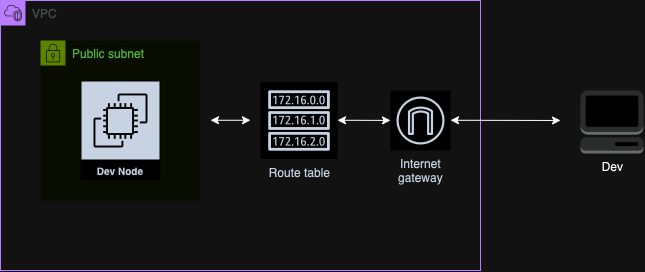

# IaC-AWS-DevEnv

#### AWS Hosted Dev Env

This terraform project allows users to automate the provisioning and configuration of a developer environment hosted on AWS. This project will be updated to include a private subnet, bastion host, Load Balancer, and an Autoscaling Group.

#### Sources

This project was based off of a freeCodeCamp.org project!
- https://www.youtube.com/watch?v=iRaai1IBlB0

I also relied heavily on the documentation on the Terraform Website
- https://registry.terraform.io/providers/hashicorp/aws/latest/docs

#### Project Key Languages/Technologies: 

- **AWS**
    - Resources: 
        - Networking: VPC, subnets, internet gateways, route tables
        - Security: Security groups, key-pairs
        - Compute: EC2
- **Terraform**
- **bash**

## Design Choices:

#### Architecture:
- 

#### IaC Tools:
- **CloudFormation vs Terraform vs Ansible**: I decided to use Terraform instead of CloudFormation or Ansible because I wanted to use a tool that was capable of managing complex states of multi-cloud infrastructure.

#### Cloud Provider:
- **AWS vs Azure vs GCP**: Since I received my AWS Associate Certification and worked most extensively with AWS, I decided to build out this project on AWS instead of Azure or GCP.

#### Version/State Control:

- **Terraform**: Terraform has many inbuilt features that make it easy to track states
    - terraform.tfstate: this file is automatically generated by terraform and lists all existing resources and their configurations
    - CLI Commands
        - terraform state 
            - shows all resources and a quick overview of what’s being managed
            - show resource_name: this will show you the resource and the current configuration of that resource
                - example: terraform state show aws_instance.dev_node
        - terraform show
            - Used when you need detailed information about specific resources or the entire infrastructure.

- **GitHub**

## Folders/Files:

- **main.tf**: Most of the AWS infrastructure resources are defined here

- **providers.tf**: Because Terraform can support different cloud platforms, this file is used to define and configure the cloud platforms that I will be using (AWS).

- **userdata.tpl**: Stores a bash script that is used to configure the EC2 instance on boot. The script installs docker and adds the ubuntu user to the docker group.

- **linux-ssh-config.tpl**: Stores a bash scrip that is used to configure the SSH access to the dev node.

- **datasource.tf**: Stores the ubuntu server AMI that we will use in this project. Allows us to avoid hardcoding the AMI into main.tf

- **outputs.tf**: This file is recognized by Terraform and allows you to access specific values after applying a configuration. In this case, it allows us to easily access the public IP address of the dev node with a "terraform output" command.

- **terraform.tfvars**: This file is recogized by Terraform and takes highest precedence when setting values to variables in .tf files. In this case, it is used to set the OS of the provisioner's interperter to linux.

- **.gitignore**: Contains files and folders that were not to be included in the GitHub Repository.